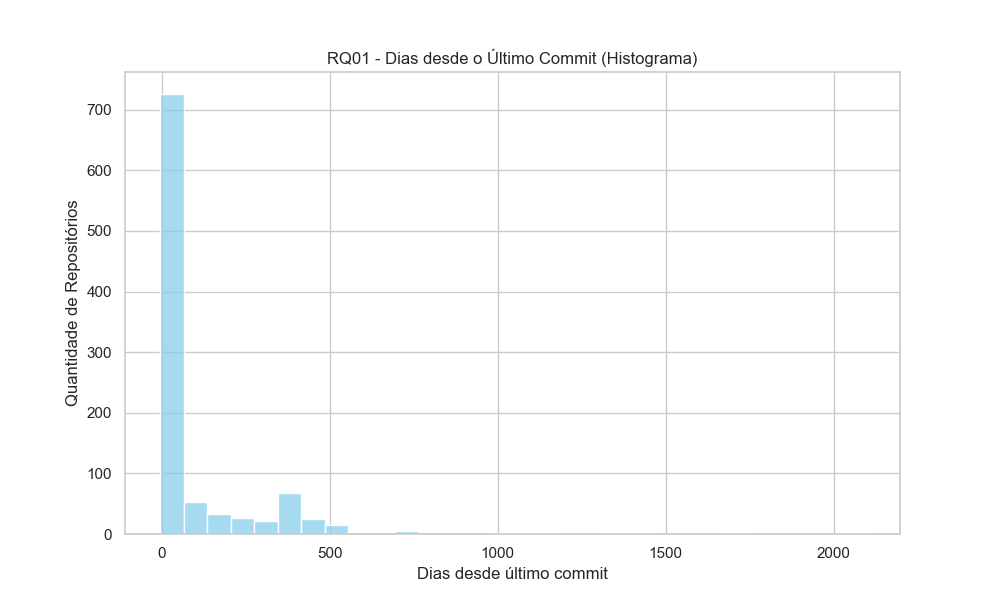
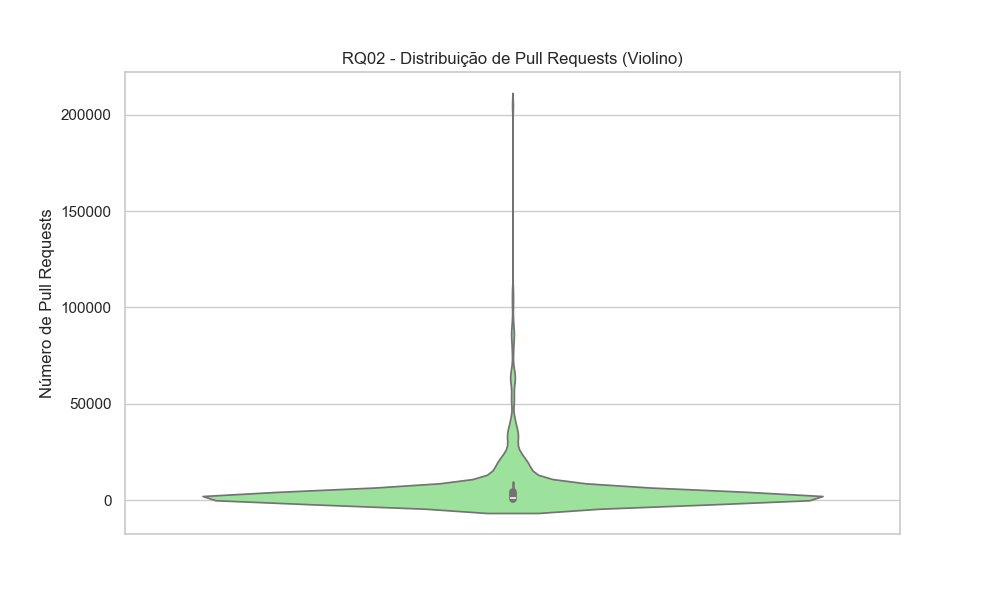
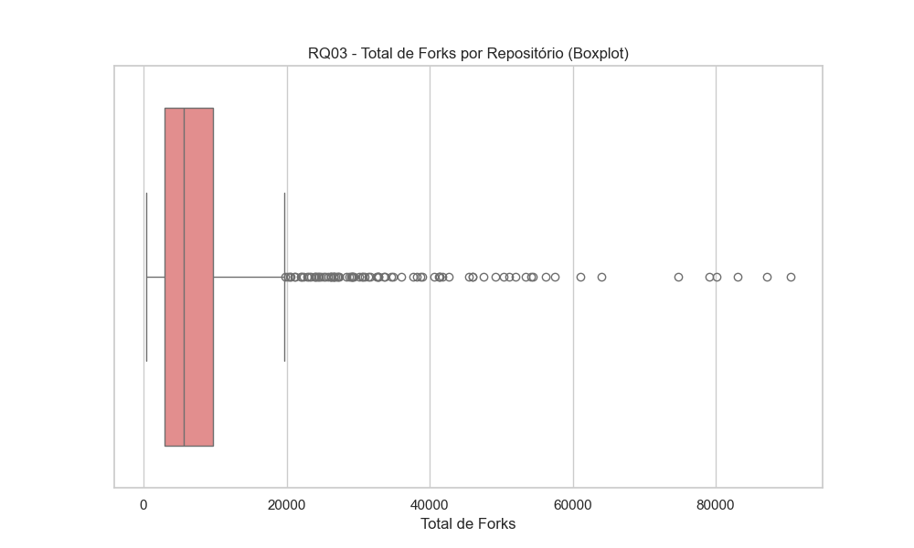
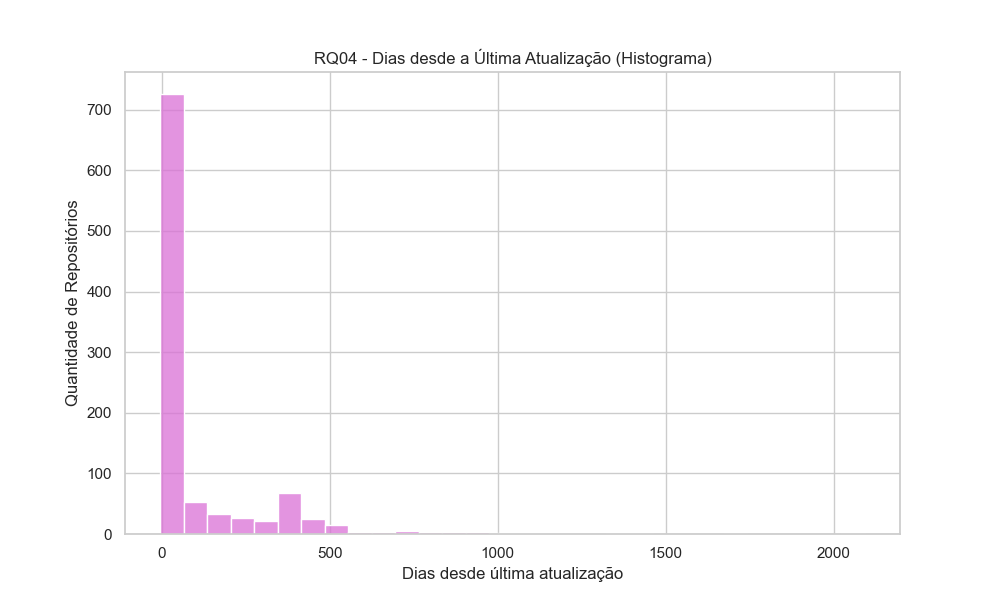
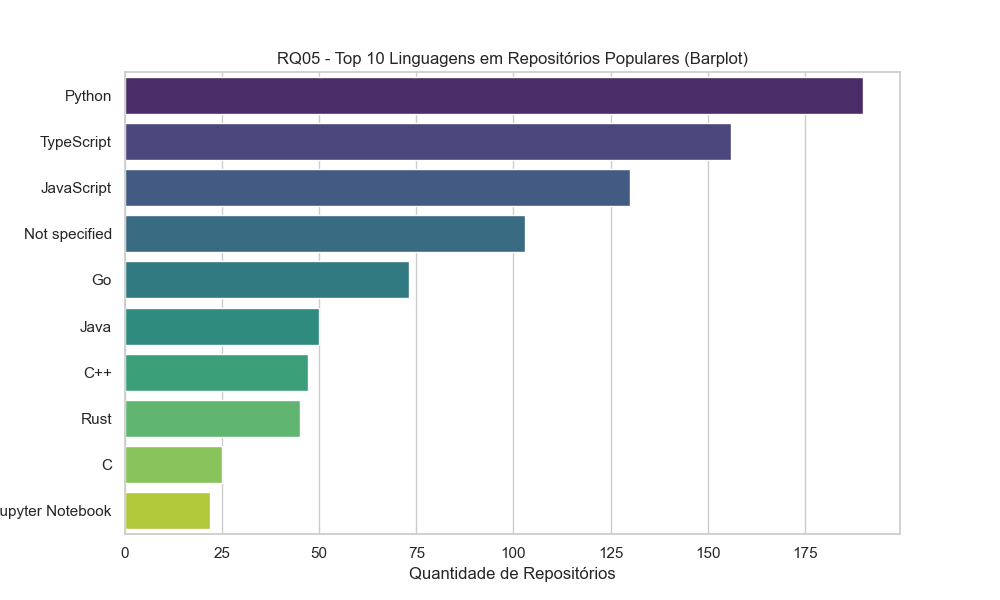
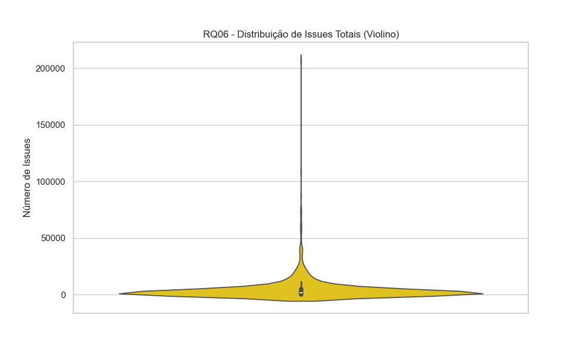

# Relatório Final – Análise de Repositórios Populares no GitHub

Augusto Noronha Leite ; David Leong Ho ;Pedro Maximo 

## 1. Introdução

O objetivo deste trabalho foi investigar as principais características dos 1.000 repositórios mais populares do GitHub (medidos em número de estrelas), analisando sua maturidade, contribuição externa, frequência de lançamentos e atualizações, linguagens de programação utilizadas e gerenciamento de issues.

**Hipóteses iniciais :**

- Repositórios populares tendem a ser relativamente maduros, mas ainda assim recebem atualizações frequentes.
- A contribuição externa é relevante, mas concentrada em alguns projetos de maior destaque.
- Releases podem não ser tão frequentes, já que muitos projetos evoluem continuamente sem lançamentos formais.
- As linguagens predominantes devem refletir as mais populares atualmente (Python, JavaScript, TypeScript, etc.).
- Projetos ativos tendem a manter uma boa proporção de issues fechadas, embora alguns acumulem grandes quantidades.

---

## 2. Metodologia

Os dados foram coletados diretamente do GitHub utilizando o GraphQL, considerando os **1.000 repositórios com maior número de estrelas**. Para cada questão de pesquisa , foram extraídas métricas específicas, aplicadas análises estatísticas básicas  e visualizações gráficas adequadas.

---

## 3. Resultados

### RQ01 – Sistemas populares são maduros/antigos?

**Métrica:** Idade do repositório.

O histograma mostra a distribuição de dias desde o último commit.

A grande maioria dos projetos apresenta commits recentes indicando que mesmo sistemas antigos continuam sendo mantidos e atualizados.

**Resultado:** Repositórios populares são, em geral, ativos, mesmo que antigos.

---

### RQ02 – Sistemas populares recebem muita contribuição externa?

**Métrica:** Total de pull requests aceitas.

A distribuição em formato de violino mostra que a maioria dos repositórios tem uma quantidade moderada de pull requests, mas alguns casos extremos chegam a dezenas ou centenas de milhares, indicando forte participação da comunidade em poucos projetos específicos.

**Resultado:** Contribuição externa existe, mas é concentrada em poucos repositórios de grande porte.

---

### RQ03 – Sistemas populares lançam releases com frequência?

**Métrica:** Total de releases (proxy: forks como indicador de disseminação).

O boxplot revela que a maioria dos repositórios tem um número relativamente baixo de forks, mas alguns projetos muito populares ultrapassam dezenas de milhares, sendo claros outliers. Isso indica que nem todos os projetos populares priorizam releases formais, mas ainda assim possuem forte disseminação na comunidade.

**Resultado:** Nem todos lançam releases com frequência, mas ainda assim são amplamente utilizados e replicados.

---

### RQ04 – Sistemas populares são atualizados com frequência?

**Métrica:** Dias desde a última atualização.

O histograma mostra que a maioria dos projetos foi atualizada recentemente (grande concentração próxima a 0 dias). Alguns poucos não recebem atualização há anos.

**Resultado:** A maioria dos sistemas populares é constantemente atualizada.

---

### RQ05 – Sistemas populares são escritos nas linguagens mais populares?

**Métrica:** Linguagem primária do repositório.

Os dados mostram predominância de **Python, TypeScript e JavaScript**, seguidos por Go, Java, C++ e Rust. Isso reflete o cenário atual de linguagens mais utilizadas em projetos open-source de grande impacto.

**Resultado:** A hipótese se confirma, linguagens populares são predominantes.

---

### RQ06 – Sistemas populares possuem um alto percentual de issues fechadas?

**Métrica:** Razão entre issues fechadas e totais (proxy: distribuição de issues).

O gráfico em violino revela que a maioria dos repositórios tem relativamente poucas issues, enquanto alguns concentram dezenas de milhares. Isso sugere que o fechamento de issues pode variar muito conforme a comunidade e a manutenção ativa.

**Resultado:** Muitos repositórios mantêm uma boa taxa de fechamento, mas há grande variação entre os projetos.

---

## 4. Discussão

- **Hipótese de maturidade:** Confirmada. Muitos projetos são antigos, mas continuam ativos.
- **Hipótese de contribuição externa:** Parcialmente confirmada. Contribuições ocorrem, mas estão muito concentradas em alguns projetos.
- **Hipótese de releases frequentes:** Parcialmente rejeitada. Releases formais não são tão frequentes quanto esperado.
- **Hipótese de atualização:** Confirmada. A maioria é atualizada recentemente.
- **Hipótese de linguagens:** Confirmada. Python, TypeScript e JavaScript dominam.
- **Hipótese de issues fechadas:** Parcialmente confirmada. Embora muitos projetos fechem issues, a grande variabilidade mostra que nem todos têm processos maduros de gestão.

---

## 5. Conclusão

A análise dos 1.000 repositórios mais populares do GitHub revela um ecossistema robusto e em constante evolução, desmistificando a ideia de que a popularidade se traduz em um modelo único. Em vez disso, observamos uma dinâmica de dois níveis:

- **O pilar da longevidade e atualização:** A maioria dos projetos populares não apenas resistiu ao teste do tempo, mas continua ativamente mantida e atualizada. Isso sugere que a popularidade é um reflexo não apenas da inovação inicial, mas da **confiança e da sustentabilidade** que a comunidade deposita neles. Projetos que não evoluem tendem a perder sua relevância, mesmo que tenham sido marcos históricos.
- **O contraste entre popularidade e centralização:** Embora a maioria dos repositórios seja atualizada com frequência, a contribuição externa, o lançamento de *releases* formais e a gestão de *issues* demonstram um fenômeno de **centralização**. Poucos projetos de grande porte, como bibliotecas de *frameworks* amplamente usados (pense em React ou TensorFlow), funcionam como centros de gravidade, atraindo a maior parte das colaborações e do esforço de gestão.

Essa dualidade sugere que a popularidade no GitHub não é homogênea. Para a maioria dos projetos, ela é construída sobre uma base sólida de **manutenção consistente e relevância contínua**. Já para a elite, a popularidade se manifesta como uma força que **agrega a comunidade e centraliza o desenvolvimento**. Em última análise, o sucesso de um repositório no GitHub parece depender menos de seguir um roteiro fixo e mais de atender às necessidades de sua base de usuários, seja por meio de um crescimento orgânico e estável ou pela capacidade de se tornar um hub de inovação.
